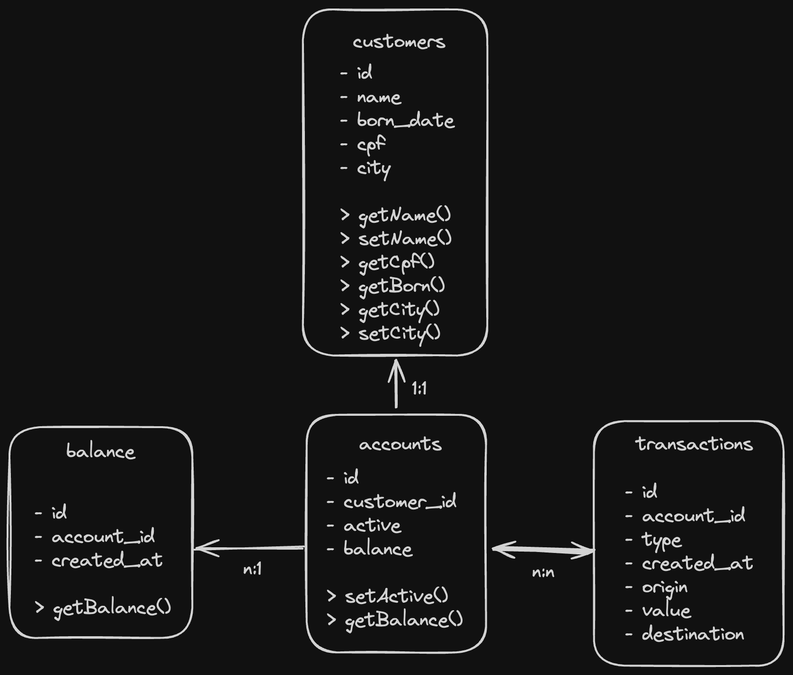

# Social Bank

Projeto desenvolvido na turma de backend e AWS na Reprograma

## Diagrama do banco



## Installation

```bash
$ npm install
```

## Running the app

```bash
# development
$ npm run start

# watch mode
$ npm run start:dev

# production mode
$ npm run start:prod
```

## Test

- Import `social-bank.postman_collection.json` to run requests on `postman`

```bash
# unit tests
$ npm run test

# e2e tests
$ npm run test:e2e

# test coverage
$ npm run test:cov
```

## Routes available

```bash
$ localhost:3005/api
```

## Database snapshot

```bash
[
  {
    id: '76a2237f-1ddc-4aa3-9db7-66f7518b8f28',
    customers: [
      {
        id: '0c2122f8-9d02-40d6-b84e-dbed3fb1f8a4',
        accounts: [],
        people: {
          id: '26e5f43c-bb42-4cf2-968b-56d32e049c56',
          name: 'Grace Hooper',
          email: 'grace@idiomaparatodos.com.br',
          city: 'Londres',
          phoneNumber: '+5511123456789',
          cpf: '12345678900',
          birthdate: '1815-12-10',
        },
        managerId: '76a2237f-1ddc-4aa3-9db7-66f7518b8f28',
      },
    ],
    people: {
      id: 'be51374d-f8d4-448e-9066-9ef5e1c7f303',
      name: 'Ada Lovelace',
      email: 'ada@idiomaparatodos.com.br',
      city: 'Londres',
      phoneNumber: '+5511123456789',
      cpf: '12345678900',
      birthdate: '1815-12-10',
    },
  },
  {
    id: '0c2122f8-9d02-40d6-b84e-dbed3fb1f8a4',
    accounts: [
      {
        id: 'ac8eede5-80d6-463a-8256-09c41dab5124',
        customerId: '0c2122f8-9d02-40d6-b84e-dbed3fb1f8a4',
        balance: 1000,
        type: 'current',
        interestRate: 0.02,
        overdraftLimit: 1000,
      },
    ],
    people: {
      id: '26e5f43c-bb42-4cf2-968b-56d32e049c56',
      name: 'Grace Hooper',
      email: 'grace@idiomaparatodos.com.br',
      city: 'Londres',
      phoneNumber: '+5511123456789',
      cpf: '12345678900',
      birthdate: '1815-12-10',
    },
    managerId: '76a2237f-1ddc-4aa3-9db7-66f7518b8f28',
  },
]
```

## Healthcheck

```bash
$ localhost:3005/api/health
```

## Backlog

[] Validar CNPJ para compras
[] Implementar conta PJ [ref][https://github.com/nathsouzadev/ON36-IJS-social-bank/pull/20]

#### Desenvolvido por Nathally Souza
