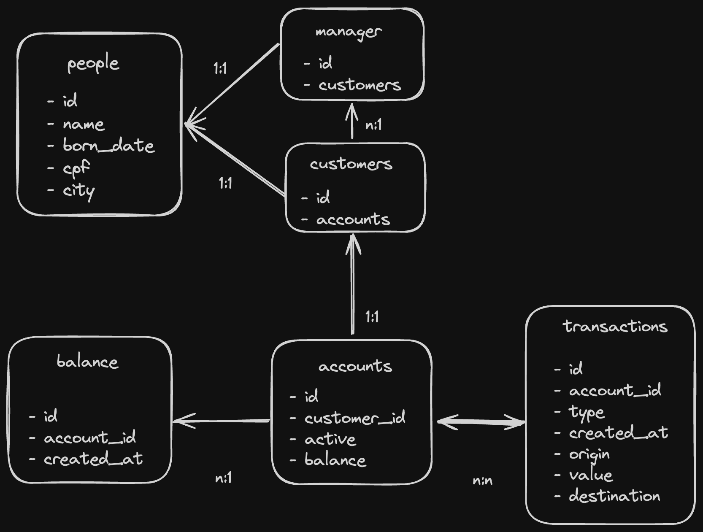

# Social Bank

Projeto desenvolvido na turma de backend e AWS na Reprograma

## Diagrama do banco



## Installation

```bash
$ npm install
```

## Running the app

```bash
# development
$ npm run start

# watch mode
$ npm run start:dev

# production mode
$ npm run start:prod
```

## Test

```bash
# unit tests
$ npm run test

# e2e tests
$ npm run test:e2e

# test coverage
$ npm run test:cov
```

## Routes available

```bash
$ localhost:3005/api
```

## Healthcheck

```bash
$ localhost:3005/api/health
```

#### Desenvolvido por Nathally Souza

WIP
/customer
[x] create customer
[x] create account
[x] update account type
[x] delete account

/manager
[x] create manager
[] update account type
[] delete account
